# Week 1 Environment Setup & Structure

## Goals

To understand the basics of a Node front-end web application structure with respects to React and Vue.

## Key Learning Objectives

1. Learn how to bootstrap a React or Vue project via their CLI's
2. Gain the basics of the application structure
3. Understand the supporting Node ecosystem and set of useful 3rd party libraries

## Why Should I Care?

The most important decision you made was the last decision.
This means that when you created your app/project, the decisions made there affected the rest of the project.

A well defined and structured app won't make, but it can break your team.

## Overview

The great thing about the Node ecosystem is that React, Vue, and Angular share a common configuration pattern and set of supporting libraries!

**Sharing across frameworks makes Mr. Corgi happy**


## First Things First

[Do you have Node >= V16 installed?](https://nodejs.org/en/)
[Do you have VSCode installed?](https://code.visualstudio.com/docs/?dv=win)
[Do you have Git installed?](https://git-scm.com/download/win)

**Service Guarantees Citizenship!**


## React or Vue?

**Please use thonks when making decision**


1. Do you already know React "well"?
2. If yes, maybe try Vue.
3. If no, please learn React first.

The purpose of this study group is for the App Services Team to get better at React. Vue is just some extra sugar that can be added because the frameworks are similar. If you don't know, please choose React. If you do both, great!

### Please use Typescript

#### The following is personal opinion that is 100% correct

There are functionally zero arguments not to use Typescript in 2022.

Please don't be, "that guy."


Also if you use the "any" type, I will find you.


### Remember: Service Guarantees Citizenship

## A Small Note About Vue

I am going to show you Vue that was created from the Vue CLI.

1. The CLI is depreciated, but it's successor is still "in development"
2. The testing libraries/tools don't work yet in the new environment and I want to keeps things similar between the examples as much as possible.

The examples will be shown with the CLI in mind, but you can choose if you want to use the new way of using Vue with Vite, or the CLI way; your choice.

## React Setup

```bash
cd C:\MyProjectLocation\WhoCares

npx create-react-app project-name --template typescript

cd project-name

npm install

npm run start
```

## Vue Setup

**You need to be in powershell!**

```powershell
cd C:\MyProjectLocation\WhoCares

npm install -g @vue/cli

vue create project-name

cd project-name

npm install

npm run start
```


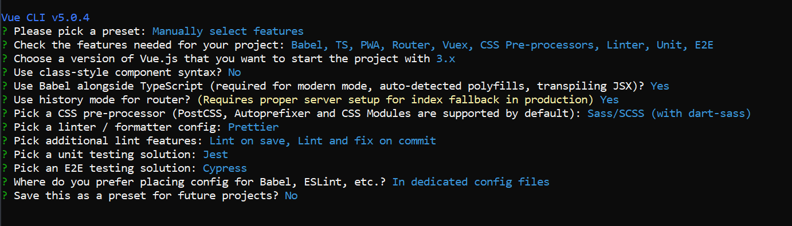

## Finished Results

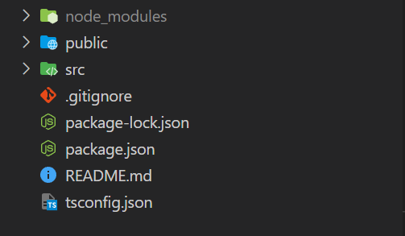

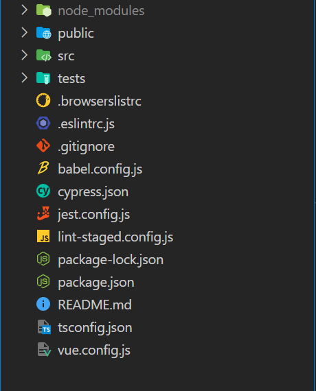

## Pre-Built Templates

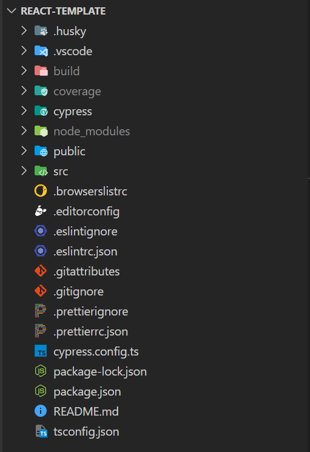

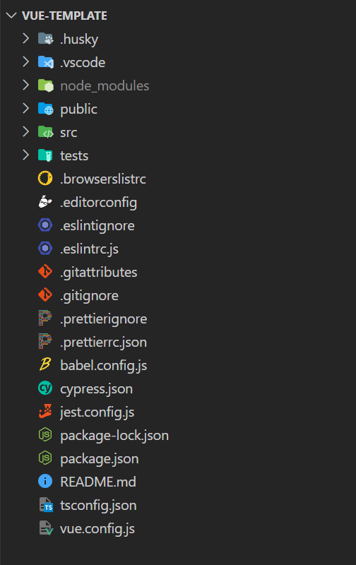

## The Who, When, What, Why, Where About The Solution

### Husky a.k.a. Dr. StrangeHook Or How I Learned To Love Automation


[Husky Website](https://typicode.github.io/husky/#/)

#### Why Husky?

Husky is a nice little library for Git hooks.

We are using a simple pre-commit hook that run a package called [Pretty-Quick](https://github.com/azz/pretty-quick) that will run [Prettier](https://prettier.io/) (A lot more to come later) on every git commit.

This will ensure that every time someone makes a commit, it will be formatted exactly as you want.

These hooks are source controlled! Yay!

#### Result

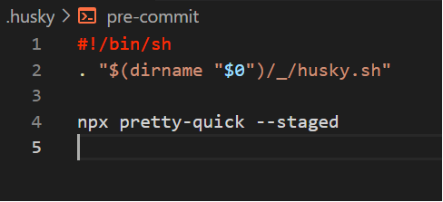

### .VSCode folder

#### Why VSCode configs?

Isn't the point of VSCode so I can have my own separate environment?

Yes, and no.

Common VSCode config files ensure that important settings are overridden on your environment.


##### Recommended Extensions


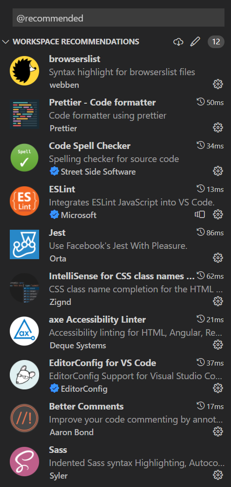

Honorable Mention: [Material UI Icons](https://marketplace.visualstudio.com/items?itemName=PKief.material-icon-theme)

##### Import Editor settings

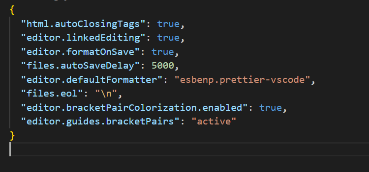

You should only override settings that are absolutely necessary for your team or ones everyone agrees with.

##### Spelling overrides

We use a plugin called [CSpell](https://marketplace.visualstudio.com/items?itemName=streetsidesoftware.code-spell-checker) that checks our spelling.

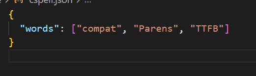

### Build

All those yummy files that we can deploy to a server.

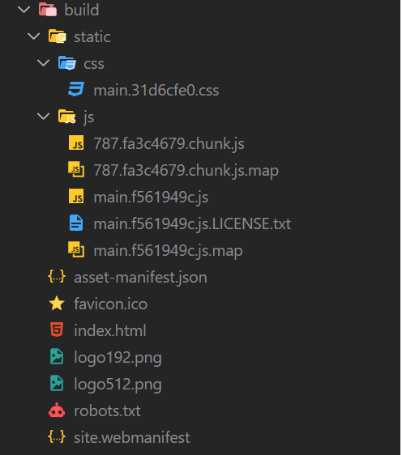

#### Build Process TLDR

1. Babel converts your TS to JS
2. Webpack takes every js, html, css file and bundles it into one of each.
3. You don't really need to know any details about what babel or webpack are doing.

### Coverage and Cypress

[Cypress](https://docs.cypress.io/guides/overview/why-cypress) is used for E2E or end-to-end testing. This can be summarized by the following:

1. Cypress is not scary.
2. You need to test the functionally of your app's API/REST calls. Cypress can intercept HTTP requests and returns what you expect.
3. You need to test mobile functionality. Cypress can resize the screen and you can assert if an element exists or does not exist in the document.
4. You can configure Cypress to test via Firefox, Chrome, Edge, IE11. Ok maybe not IE11.
5. Cypress is not scary.
6. Use Cypress for E2E. Testing Library + Jest Dom + User Event are much better for testing components and basic user interaction.
7. Cypress is not scary.

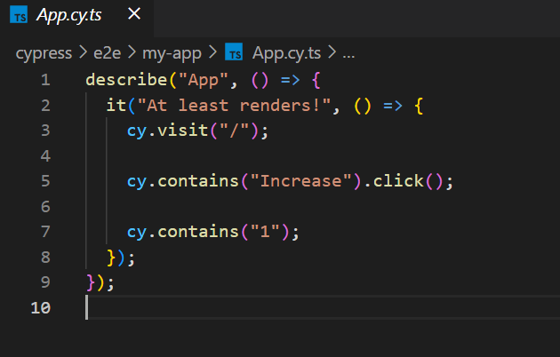

### node_modules a.ka. the interwebs


#### First rule of development club: Delete your node_modules and package-lock and npm install


### Public

Contains your index.html, favicon, and other stuff.

This folder gets copy-pasta'ed into your build folder almost as is.

(You shouldn't need to touch it that much.)

### Config files first

#### Browser support, configured

[Browserslist](https://github.com/browserslist/browserslist), a way to source control and enforce the browsers your support! Uses [CanIUse](https://caniuse.com/) under the hood.


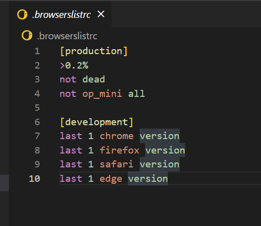

You can install and configure a bunch of plugins that will look at this config and yell if you can't do that.

1. Autoprefixer
2. Babel
3. eslint-plugin-compat (we use this)
4. Css normalize

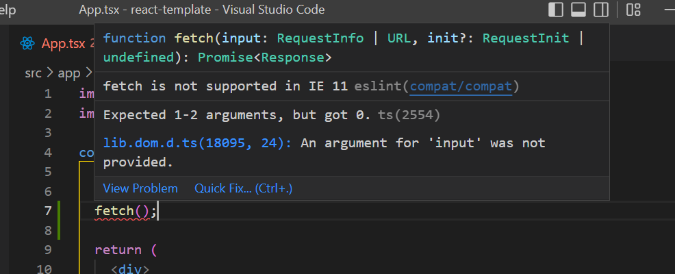

#### EditorConfig, how you punish Vim and Emacs users

[EditorConfig](https://editorconfig.org/) is how you can enforce certain settings that go cross-editor.

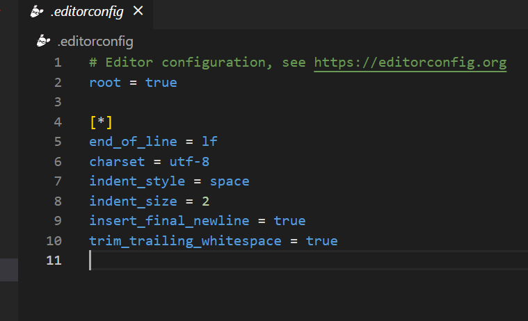

Ensures that anyone who open the project in VisualStudio, Vim, or Emacs will respect at least the most basic file settings.

Think it as a last resort against a Functional Phil.

#### Gitignore and Gitattributes

Pretty self explanatory.

#### ESLint

[ESLint](https://eslint.org/) is a linter for our codebase. We can define rules or use rules that other people have defined that keep our code in check.

Examples:

1. No un-used vars
2. No console logs
3. Functions need return types

A linter is different from a formatter. We use Prettier to format our code. They are separate. **Just because ESLint can format doesn't mean it should be used.**

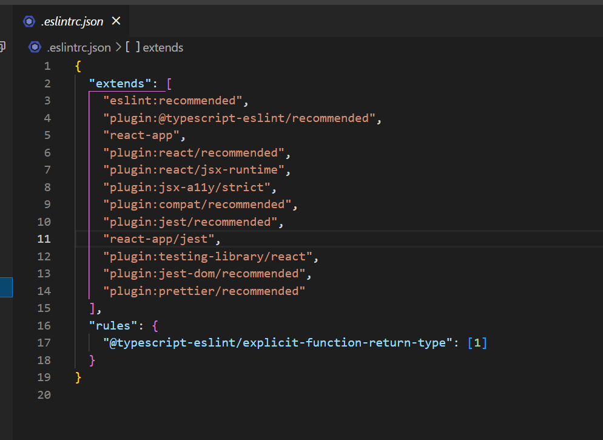

The order of what plugins you extend from matters. The most recent plugin takes precedence over the previous one.

Cypress has its own config because some jest rules conflict with it.


Turn on all the eslint/typescript/react rules and you'll be a better developer.

#### Prettier, the holy war generator

Rules for formatting rules:

1. Decide on them early in the project.
2. Never talk about them again.
3. Use an auto-formatter to enforce, i.e. Prettier.

##### Why Prettier?

Prettier is purposely opinionated. The whole point is that you and your team make as few ~~choices~~ arguments as possible.

The point of Prettier is to not have to make the decision in the first place.

There should really be only 4-5 things your team needs to come to terms on:

PrintWidth, line endings, trailing commas, spacing...but only PrintWidth has any noticeable difference.

```json
{
  "printWidth": 80, // This should be talked about
  "tabWidth": 2, // None
  "useTabs": false, // Of
  "semi": true, // This
  "singleQuote": false, // Maybe this...maybe.
  "quoteProps": "as-needed",
  "jsxSingleQuote": false,
  "trailingComma": "es5", // Shit (earmuffs)
  "bracketSpacing": true, // Matters
  "bracketSameLine": false,
  "arrowParens": "always",
  "requirePragma": false,
  "insertPragma": false,
  "proseWrap": "preserve",
  "htmlWhitespaceSensitivity": "css",
  "endOfLine": "lf", // Can be annoying on Windows machines.
  "embeddedLanguageFormatting": "auto",
  "singleAttributePerLine": false
}
```

If your team can't come to a decision, just use the default and get it over with.
