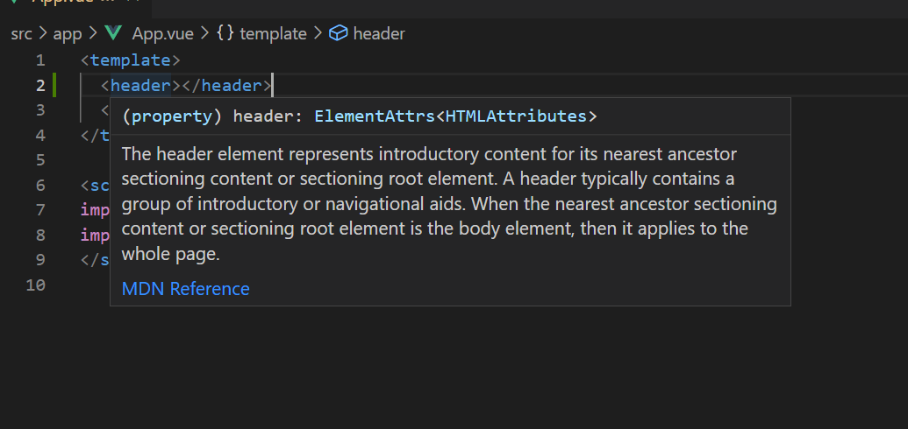
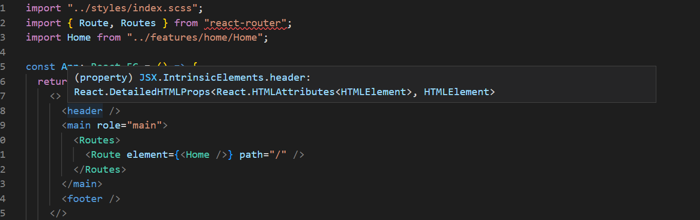

# Week 3: Bindings and Nodes and Projection (Oh my!)

## Goals

Understand the basics of how React and Vue approach building components, binding, and simple content projection.

## Key Learning Objectives

1. React JSX and Vue templates
2. How React and Vue approaching Binding
3. Content Projection

## Show And Tell

Who has a project that they would like to show the class?


## Backup Plan


### Pop Quiz

1. How does data flow in React/Vue?
2. How does composition relate to React/Vue?
3. Is React JS first or HTML first? Vue?

## Component 101

### Vue

#### MyComponent.vue

```jsx
<template>
  // html, components, in here
</template>

<script setup lang="ts">
  // imports and js go here
</script>
```

### React

#### MyComponent.tsx

```jsx
//imports up here

const MyComponent: React.FC = () => {
  //js in here

  return( //jsx in here
  );
};

// props interface here if needed

export default MyComponent;
```

## Vue templates

> Vue uses an HTML-based template syntax that allows you to declaratively bind the rendered DOM to the underlying component instance's data. All Vue templates are syntactically valid HTML that can be parsed by spec-compliant browsers and HTML parsers. - Vue Docs

Vue uses HTML compliant syntax to achieve its goals.

### Template

Template is an html tag that can hold content that will be loaded when needed.

```html
<template>
  <h2>Flower</h2>
  
</template>
```

How it looks inside a Vue component:

#### Component.vue

```html
<template>
  <h2>Flower</h2>
  
</template>

<script setup lang="ts">
  // TS goes in here
</script>
```

The setup tag is syntactic sugar in Vue for doing the following:

```javascript
import { defineComponent } from "vue";

export default defineComponent({
  name: "MyComponent",
  components: {},
  props: {},
  setup() {
    return {};
  },
});
```

.Vue files are just Vue's internal way of being able to combine both HTML and JS/TS, they serve the same function as JSX/TSX do in React.

The Volar and Volar (typescript) VSCode plugins allow you to get a decent level of intellisense from .Vue files.

The "reasoning" behind templates is that they enjoy "compile-time optimizations" that are not present in JSX/TSX.

## React JSX

JSX is far more powerful than Vue templates, but as the same implies, its just JS/TS that you can add html too. Except that its the jsx form of html.





Question Time:


What is the difference between these two C# statements?

What do they have to do with JSX?

```csharp
Expression<Func<int, bool>> IsEven = (x) => x % 2 == 0;

Func<int, bool> IsEven = (x) => x % 2 == 0;
```

### Nodes and Elements

You can think of JSX and browser specific html/css/js in the same way.

React has ReactNode, JSX.Element, ReactElement, ReactChildren, ReactChild. Its a lot.

All you need to know is JSX.Element and ReactNode.

1. JSX.Element = simple statements or expressions that return jsx.

```jsx
const someJsx: JSX.Element = <p>Hello There!</p>;
```

2. ReactNode is what is returned from a "return()" function inside of a component.

```jsx
const MyComponent: React.FC = () => {
  const someJsx = <p>Hello There!</p>; // JSX.ELement;

  return { someJsx };
};

export default MyComponent;
```

```jsx
const result = MyComponent(); // ReactNode;
```

How to think about it:

1. Components = React.Node = result of the return() function;
2. _Mostly_ Everything Else = JSX.Element = a statement or expression

#### Why do I need to know this?

You will need to use the correct type for certain features:

1. Content Projection - ReactNode
2. Functions that return JSX (switch, conditional, map) - JSX.Element

#### More JSX fun

Which can be used in a component...

You can have a function return a JSX.Element

```jsx
const Hello = (content: string): JSX.Element => {
  return <p>{content}</p>;
};
```

```jsx
const MyComponent: React.FC = () => {
  const Hello = (content: string): JSX.Element => {
    return <p>{content}</p>;
  };

  return { Hello('Hello again!') };
};

export default MyComponent;
```

### Yes, you can do almost anything


That is because anything between the "{}" can be js/ts.

```jsx
const MyComponent: React.FC = () => {
  return {
    //the world is your oyster
  };
};

export default MyComponent;
```

### Just because you can, doesn't mean you should


#### Remember! Every logical branch in your code/jsx becomes a test

### Quick Notes about jsx


#### CSS Classes

```jsx
<p class="has-text-primary">Hi!</p> -- Invalid

<p className="has-text-primary">Hi!</p> -- Valid
```

#### Label id

```jsx
<label for="myInput">
  <input id="myInput" /> -- Invalid
</label>

<label htmlFor="myInput">
  <input id="myInput" /> -- Invalid
</label>
```

## Vue Bindings 101

### Interpolation

Use the "mustache" for interpolation.

```html
<template>
  <p>{{ myDisplayText }}</p>
</template>

<script setup lang="ts">
  // omitted for brevity
</script>
```

### Attributes

```html
<template>
  <p :class="has-text-primary">Hello There!</p>
</template>

<script setup lang="ts">
  // omitted for brevity
</script>
```

this is short for...

```html
<template>
  <p v-bind:class="has-text-primary">Hello There!</p>
</template>

<script setup lang="ts">
  // omitted for brevity
</script>
```

This is used for any major attribute such as class, id, disabled, role, aria-xxx, required, ect.

### Expressions

Expressions can be done in either the "mustache" or ":" notation.

```html
<template>
  <p>{{ showText ? "Hello Michael" : "Sign In" }}</p>
</template>

<script setup lang="ts">
  import { defineProps } from "vue";

  defineProps<{
    showText: boolean;
  }>();
</script>
```

With expressions I have two logical branches. What does that mean?


```typescript
describe("Basic Component", () => {
  it("Shows proper text when logged in", () => {
    render(BasicComponent, { props: { showText: true } });

    expect(screen.getByText(/hello michael/iu)).toBeInTheDocument();
  });

  it("Show proper text when logged out", () => {
    render(BasicComponent, { props: { showText: false } });

    expect(screen.getByText(/sign in/iu)).toBeInTheDocument();
  });
});
```

Expressions in attributes:

```html
<template>
  <p :class="isBlue ? 'is-blue' : 'is-red'">Hello There!</p>
</template>

<script setup lang="ts">
  import { defineProps } from "vue";

  defineProps<{
    isBlue: boolean;
  }>();
</script>

<style scoped>
  .is-blue {
    color: skyblue;
  }

  .is-red {
    color: maroon;
  }
</style>
```

and the test...

```typescript
describe("Class conditional", () => {
  it("Has correct class when blue", () => {
    render(ClassConditional, { props: { isBlue: true } });

    expect(screen.getByText(/hello there/iu)).toHaveClass("is-blue");
  });

  it("Has correct class when not blue", () => {
    render(ClassConditional, { props: { isBlue: false } });

    expect(screen.getByText(/hello there/iu)).toHaveClass("is-red");
  });
});
```

In Short:

Interpolation = {{ value }} = used between tags <>{{ junk }}</>
Attributes = :myAttribute="myVariable" = used inside of tags <:junk="moreJunk"></>

Directives will be covered in two weeks!

## React Bindings 101

Binding in React is dead simple, and you've already seen it.

Just use the "{}" whenever you need it.

```jsx
return <p>{myTextContent}</p>;
```

```jsx
const myClassName = "has-text-primary";

return <p className={myClassName}>Hi!</p>;
```

```jsx
return <p className={isActive ? "has-text-success" : "has-text-danger"}>Hi!</p>;
```

Hard coded values don't need {}.

```jsx
return <p className="myClass">Hi!</p>;
```

Directives work that same way! In a later topic.

## Content Projection

Content projection is a method of allowing components to have children, but the children do not require any interaction with their parents.

Think of layout components such as containers, columns, sections, ect. All of these components don't need to interact with any else.

### Vue Slots

```html
<template>
  <div class="container">
    <slot></slot>
  </div>
</template>

<script setup lang="ts"></script>
```

```jsx
<template>
  <Container>Hello I am the child content!</Container>
</template>
```

Vue can do multiple slots:

```html
<template>
  <div class="container">
    <slot name="first"></slot>
    <slot name="second"></slot>
  </div>
</template>

<script setup lang="ts"></script>
```

```vue
<template>
  <Container>
    <template #first> First Slot </template>
    <template #second> Second Slot </template>
  </Container>
</template>
```

### React Content Projection

```jsx
const Container: React.FC<ContainerProperties> = ({ children }) => {
  return <div class="container">{{ children }}</div>;
};

interface ContainerProperties {
  children: ReactNode; // needs to be named children
}

export default Container;
```

Can be used just like how you expect it:

```jsx
<Container>Hello I am the child content!</Container>
```

Content Projection let you remove a lot of boiler plate. You can create large component trees and then slot/content projection in the content needed. If you have used tagHelpers in ASP.NET before, this is the same concept, but much more powerful.

```jsx
<Section>
  <Container>
    <Columns>
      <Column />
        <Column> {{ children }}</Column>
      <Column />
    <Columns />
  <Container />
<Section />
```

```jsx
const CenteredSection: React.FC = () => {
  return();
};
```

### Abstracting away html

what looks better?

```jsx
<section className="section">
  <div className="container">
    <div className="columns">
      <div className="column" />
      <div className="column">{{ children }}</div>
      <div className="column" />
    </div>
  </div>
</section>
```

vs.

```jsx
<Section>
  <Container>
    <Columns>
      <Column />
        <Column> {{ children }}</Column>
      <Column />
    <Columns />
  <Container />
<Section />
```

#### The division tag is a terrible abstraction, it only implies the following content is block

Remember the point of React/Vue is to abstract away html, css, and js to some degree and put components first.

Note in Vue, you need to name your components with two words because they are html compliant and not case sensitive.

i.e. Section = section = native section tag

```jsx
<LayoutSection>
  <LayoutContainer>
    <LayoutColumns>
      <LayoutColumn />
        <LayoutColumn> {{ children }}</Column>
      <LayoutColumn />
    <LayoutColumns />
  <LayoutContainer />
<LayoutSection />
```

## The Homework


1. Create some basic components that use basic binding (interpolation or attribute)
2. Use Content Projection in some form (grab your fav css framework) and make a few basic components or style it yourself
3. Write any tests when you have multiple logical branches
4. Maybe no pop quiz next week...maybe.

## Question Time


